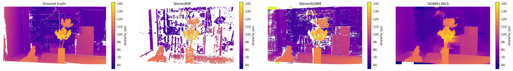
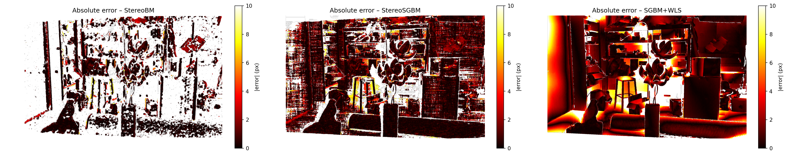
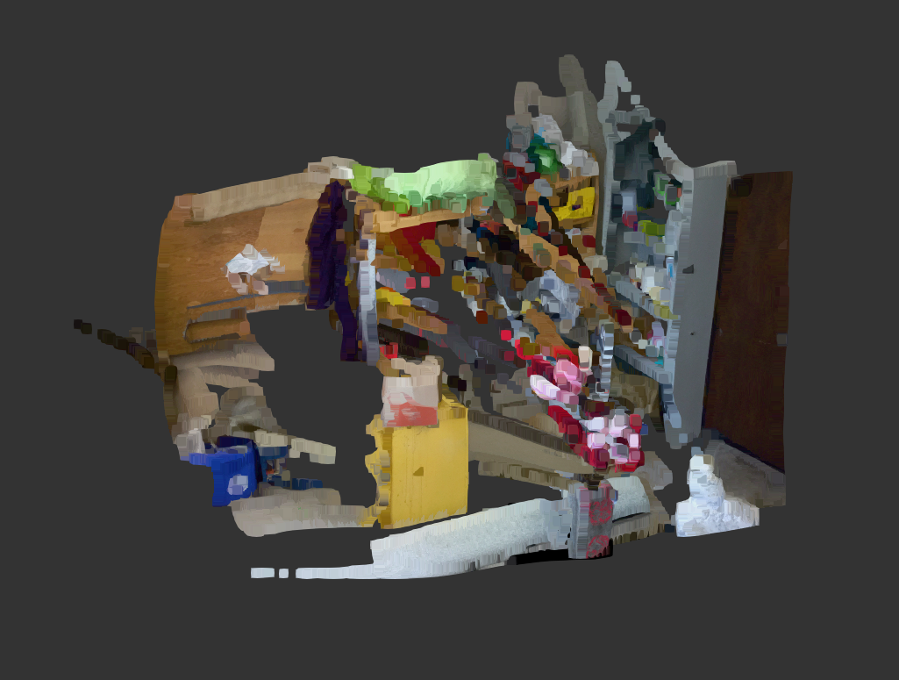
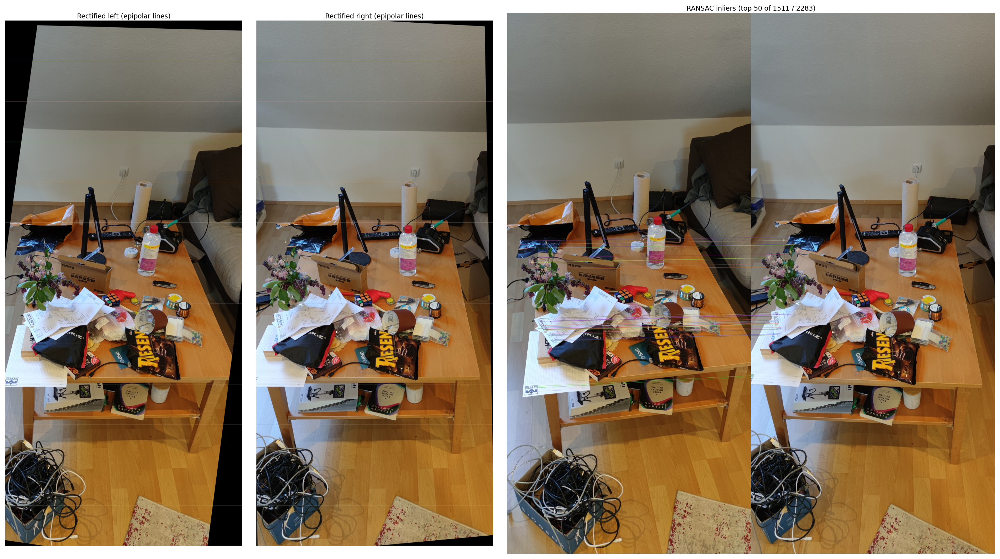
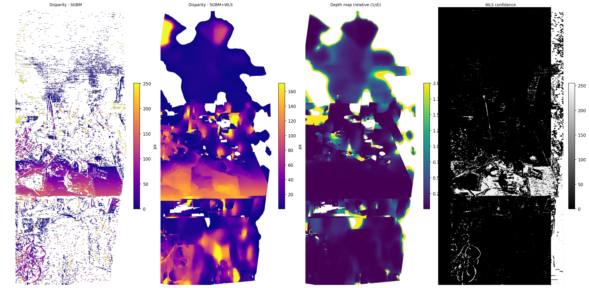

# 3DCV-practice

This repository contains the code and resources for the 3D Computer Vision (3DCV) course at Hochschule Furtwangen. The accompanying website can be found at [https://uhahne.github.io/3DCV/](https://uhahne.github.io/3DCV/).

# Excercise 1

The purpose of this set of scripts is to capture images of a chess board pattern and extract intrinsic calibration parameters from them. Then, another script uses those calibration data to project a virtual coordinate system onto that same checkerboard pattern in real time.

## Capturing images

To capture images, run

```
python3 scripts/ex1/capture.py
```

In this interactive script, you can:
- Delete all previous images by pressing 'D'
- Capture the current image by pressing 'S'
- Quit by pressing 'Q'

The images are stored into `captured_images`. You should take images with a checkerboard pattern at different locations in the image.

## Computing calibration parameters

The images captured in the last step are all used to compute the calibration parameters. You can execute this by doing

```
python3 scripts/ex1/detect_intrinsics.py
```

The output is stored in `calibration.npz`.
You can test if this worked correctly by executing

```
python3 scripts/ex1/undistort.py
```

This should display the captured image, alongside the corrected, processed image.

## Projecting the coordinate system

If the previous steps were followed and the camera calibration is setup, you can run

```
python3 scripts/ex1/project_coordinate_system.py
```

This will overlay a 3D coordinate system over the captured video stream in real time.

# Excercise 2

The purpose of this excercise is to measure the height of a cup, relative to a known reference object (bottle).
To do this, execute

```
python3 scripts/ex2/height_measurement.py
```

You'll get a loupe window, which is just a zoomed in version of the area around your mouse for precise picking. You'll also get the main window, in which you must select the following points in order:

1. Start and end point of the first of the two parallel ground reference lines (i.e one table edge)
2. Start and end point of the second parallel ground reference lines (i.e the other, parallel table edge)
3. Base and Top of the bottle
4. Base and Top of the cup

All relevant information such as helper lines will be displayed in the main image after the relevant points are selected. When all points have been selected, the estimated height will be output next to the projected lines. It is also output on the terminal.

Using this script, I get an estimated cup height of ~11.3 cm.

# Exercise 3 – Simple Stereo

## How to run

```
python3 scripts/ex3/stereo.py
```

All outputs are written to `data/`. No arguments needed.

## What it produces

| Output file | Description |
|---|---|
| `stereo_pair.png` | Side-by-side stereo images |
| `disparity_{bm,sgbm,wls}.png` | Colour-coded disparity maps |
| `disparity_comparison.png` | GT + all three maps side by side |
| `disparity_error_maps.png` | Per-pixel absolute error (hot colourmap) |
| `wls_confidence.png` | WLS filter confidence map |
| `depth_map_*.png` | Depth maps in mm |
| `pointcloud_*.ply` | Point clouds (raw + statistically cleaned) |

## Evaluation results

Only pixels that are finite and positive in **both** ground truth and prediction are counted.
WLS is evaluated only on pixels where SGBM also has a valid prediction, so all three methods are compared on the same set of pixels (see below).

| Method | MAE (px) | bad > 1 px | bad > 2 px |
|---|---|---|---|
| StereoBM | 3.24 | 23.7 % | 14.3 % |
| StereoSGBM | 3.07 | 32.1 % | 17.2 % |
| SGBM+WLS | **2.33** | 41.3 % | 23.4 % |

### WLS evaluation: excluding the extra coverage

WLS fills in regions where SGBM had no valid match (occlusion boundaries, low-texture zones) by propagating disparity from nearby confident areas. Those filled pixels are positive and finite, so they pass the validity mask — but they are guesses, often wrong, and naively inflated WLS's MAE from 2.33 to 3.37 px and its bad-pixel rates by ~10–12 pp.

To compare fairly, WLS is restricted to the pixels where SGBM also has a valid prediction (`sgbm_coverage = np.isfinite(sgbm_disp) & (sgbm_disp > 0)`). On this shared set WLS achieves the best MAE (2.33 px vs 3.07 for SGBM), confirming that the smoothing genuinely improves accuracy where SGBM already has data. The bad-pixel rates remain higher than SGBM's because WLS edge-sharpening introduces small (~1 px) lateral shifts at depth discontinuities that push pixels just over the 1 px threshold.

### Point cloud sizes

| Method | Raw | After outlier removal |
|---|---|---|
| StereoBM | 681,775 | 675,113 (−1.0 %) |
| StereoSGBM | 1,556,495 | 1,526,156 (−1.9 %) |
| SGBM+WLS | 1,852,134 | 1,806,390 (−2.5 %) |

Statistical outlier removal (k = 20 neighbours, 2 σ threshold) keeps between 97.5 % and 99.0 % of points. WLS produces the densest cloud but also the most outliers, consistent with its aggressive hole-filling behaviour. The cleaned PLY files are recommended for viewing in MeshLab.







# Exercise 4 – Stereo Rectification from Own Image Pair

## Capture setup

The stereo pair was captured hand-held with a single camera, moving it sideways between the two shots. Three different cameras were tried before getting usable results:

- The first one was the integrated webcam of my laptop. It produced too low a resolution, resulting in bad matching for SIFT.
- The second one was a 720p WebCam, which suffered the same result, but with even poorer contrasts and more noise.
- My smartphone camera finally gave enough resolution and sharpness to produce a stable rectification.

The scene used shows my couch table in its least organized state with lots of different objects, at an angle. This gives a lot of good points for the matching and rectification process. The phone was moved approximately 20 cm sideways between shots.

Images are stored as:
- `images/my_pair_left.png`
- `images/my_pair_right.png`

### Depth

No baseline was measured, so depth is **relative only** (`BASELINE_M = None` in the script). Focal length is taken from the intrinsic calibration computed in Exercise 1 (`calibration.npz`, `K[0,0] = 621.5 px`). To enable metric depth, set `BASELINE_M` to the measured baseline in metres at the top of `scripts/ex4/stereo_rectify.py`. (This of couse won't change the visual appearance of the depth map, only the scale).

## How to run

```
python3 scripts/ex4/stereo_rectify.py
```

All outputs are written to `data/`. No arguments needed. To tune disparity range, adjust `NDISP` at the top of the script (must be divisible by 16; the script rounds up automatically).

**Note:** My dinky old laptop with 8 GB RAM could not handle processing the full resolution images and would run out of memory, especially the WLS filter. So, the images were downscaled before processing. If you run into memory issues, downscale the input pair before running the script (e.g. `mogrify -resize 50% images/my_pair_*.png`).

## What it produces

| Output file | Description |
|---|---|
| `ex4_rectified_left.png` / `ex4_rectified_right.png` | Warped image pair after uncalibrated rectification |
| `ex4_disparity_sgbm.png` | Colour-coded SGBM disparity (exercise-description parameters) |
| `ex4_disparity_wls.png` | Colour-coded SGBM+WLS disparity |
| `ex4_depth.png` | Colour-coded depth map (relative, 1/d) |
| `ex4_rectification.png` | Figure: rectified pair with epipolar guide lines + RANSAC inlier matches |
| `ex4_stereo.png` | Figure: SGBM disparity, WLS disparity, depth map, WLS confidence |

## Results and discussion





**Feature matching and rectification** worked well. SIFT with Lowe's ratio test (0.75) found over 2000 matches on the desk scene, with roughly 1500 RANSAC inliers. The rectified images show clear horizontal alignment of corresponding features, confirmed by the epipolar guide lines in `ex4_rectification.png`.

**Disparity (WLS)** is the most satisfying result. The SGBM+WLS map shows smooth, coherent surfaces on the desk and wall, with good depth ordering — foreground objects are visibly closer than the background, especially in areas with high contrast (between objects on the table). The plain SGBM map (exercise-description parameters) is noisier and has more holes, as expected.

**Depth map** is the weakest result. Because the depth is purely relative (`1/d`), the scale is arbitrary and the distribution is heavily skewed — small disparity errors in low-texture regions produce very large `1/d` values that compress the interesting near-field range into a narrow band of the colormap. A hard depth cap (`MAX_DEPTH_CM`) was tried to push the colormap range toward the near field, but this made things worse: the scene depth range (30–100 cm) sits near the top end of a fixed 0–MAX cap, so nearly all pixels still cluster at the yellow end. The auto percentile scaling (5th–95th) works better because it spreads the colormap across whatever range the data actually contains, regardless of absolute scale.

### Failure cases

- **Near-zero disparity in flat regions** (white wall, floor): SGBM assigns very small or zero disparity here, which after `1/d` inversion becomes an extreme depth value. Clipping at the 5th–95th percentile partially mitigates this in the visualisation but does not fix the underlying estimate.
- **Rectification warp distortion**: `stereoRectifyUncalibrated` can produce strong perspective warps when the baseline is not purely horizontal. Large parts of the image frame can fall outside the valid warp region; these are masked out before disparity computation using the intersection of both homography footprints.
- **Memory pressure**: on an 8 GB laptop the WLS filter is the bottleneck. Downscaling to 50 % halved peak RAM usage at the cost of disparity resolution.
