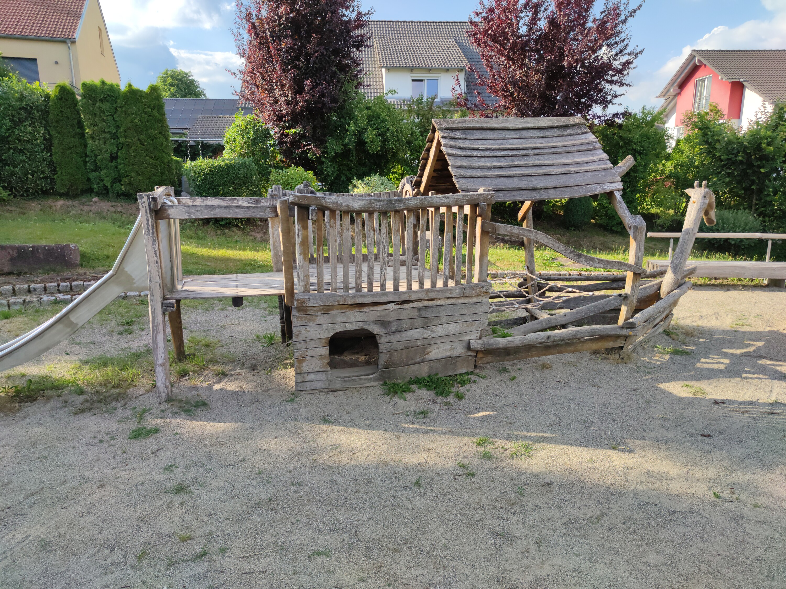
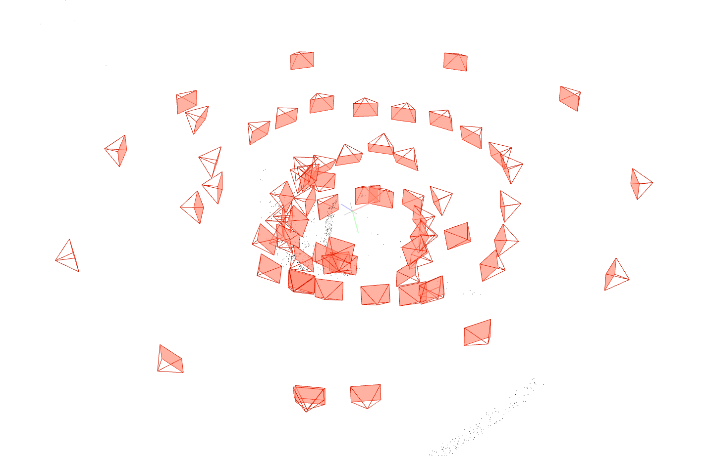
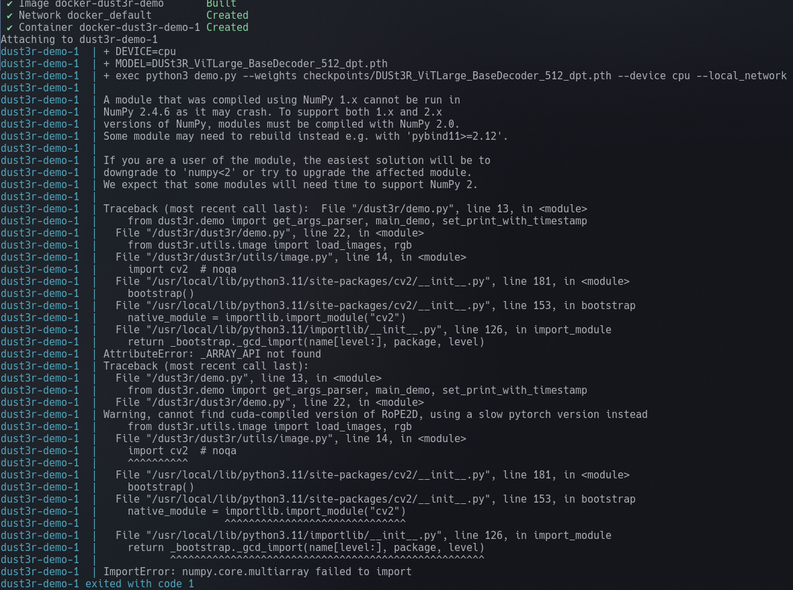
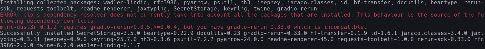
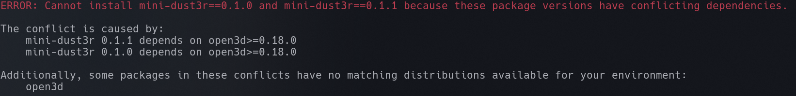
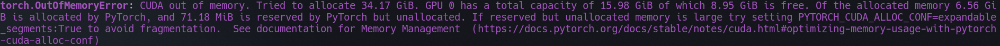
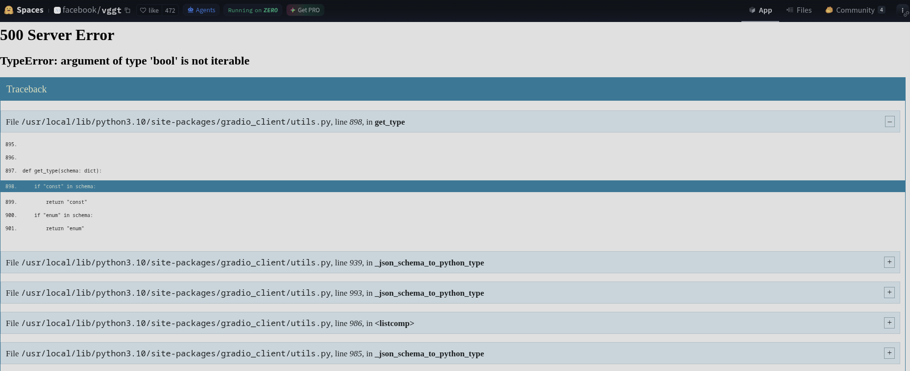

# 3DCV-practice

This repository contains the code and resources for the 3D Computer Vision (3DCV) course at Hochschule Furtwangen. The accompanying website can be found at [https://uhahne.github.io/3DCV/](https://uhahne.github.io/3DCV/).

# Excercise 1

The purpose of this set of scripts is to capture images of a chess board pattern and extract intrinsic calibration parameters from them. Then, another script uses those calibration data to project a virtual coordinate system onto that same checkerboard pattern in real time.

## Capturing images

To capture images, run

```
python3 scripts/ex1/capture.py
```

In this interactive script, you can:
- Delete all previous images by pressing 'D'
- Capture the current image by pressing 'S'
- Quit by pressing 'Q'

The images are stored into `captured_images`. You should take images with a checkerboard pattern at different locations in the image.

## Computing calibration parameters

The images captured in the last step are all used to compute the calibration parameters. You can execute this by doing

```
python3 scripts/ex1/detect_intrinsics.py
```

The output is stored in `calibration.npz`.
You can test if this worked correctly by executing

```
python3 scripts/ex1/undistort.py
```

This should display the captured image, alongside the corrected, processed image.

## Projecting the coordinate system

If the previous steps were followed and the camera calibration is setup, you can run

```
python3 scripts/ex1/project_coordinate_system.py
```

This will overlay a 3D coordinate system over the captured video stream in real time.

# Excercise 2

The purpose of this excercise is to measure the height of a cup, relative to a known reference object (bottle).
To do this, execute

```
python3 scripts/ex2/height_measurement.py
```

You'll get a loupe window, which is just a zoomed in version of the area around your mouse for precise picking. You'll also get the main window, in which you must select the following points in order:

1. Start and end point of the first of the two parallel ground reference lines (i.e one table edge)
2. Start and end point of the second parallel ground reference lines (i.e the other, parallel table edge)
3. Base and Top of the bottle
4. Base and Top of the cup

All relevant information such as helper lines will be displayed in the main image after the relevant points are selected. When all points have been selected, the estimated height will be output next to the projected lines. It is also output on the terminal.

Using this script, I get an estimated cup height of ~11.3 cm.

# Exercise 3 – Simple Stereo

## How to run

```
python3 scripts/ex3/stereo.py
```

All outputs are written to `data/`. No arguments needed.

## What it produces

| Output file | Description |
|---|---|
| `stereo_pair.png` | Side-by-side stereo images |
| `disparity_{bm,sgbm,wls}.png` | Colour-coded disparity maps |
| `disparity_comparison.png` | GT + all three maps side by side |
| `disparity_error_maps.png` | Per-pixel absolute error (hot colourmap) |
| `wls_confidence.png` | WLS filter confidence map |
| `depth_map_*.png` | Depth maps in mm |
| `pointcloud_*.ply` | Point clouds (raw + statistically cleaned) |

## Evaluation results

Only pixels that are finite and positive in **both** ground truth and prediction are counted.
WLS is evaluated only on pixels where SGBM also has a valid prediction, so all three methods are compared on the same set of pixels (see below).

| Method | MAE (px) | bad > 1 px | bad > 2 px |
|---|---|---|---|
| StereoBM | 3.24 | 23.7 % | 14.3 % |
| StereoSGBM | 3.07 | 32.1 % | 17.2 % |
| SGBM+WLS | **2.33** | 41.3 % | 23.4 % |

### WLS evaluation: excluding the extra coverage

WLS fills in regions where SGBM had no valid match (occlusion boundaries, low-texture zones) by propagating disparity from nearby confident areas. Those filled pixels are positive and finite, so they pass the validity mask — but they are guesses, often wrong, and naively inflated WLS's MAE from 2.33 to 3.37 px and its bad-pixel rates by ~10–12 pp.

To compare fairly, WLS is restricted to the pixels where SGBM also has a valid prediction (`sgbm_coverage = np.isfinite(sgbm_disp) & (sgbm_disp > 0)`). On this shared set WLS achieves the best MAE (2.33 px vs 3.07 for SGBM), confirming that the smoothing genuinely improves accuracy where SGBM already has data. The bad-pixel rates remain higher than SGBM's because WLS edge-sharpening introduces small (~1 px) lateral shifts at depth discontinuities that push pixels just over the 1 px threshold.

### Point cloud sizes

| Method | Raw | After outlier removal |
|---|---|---|
| StereoBM | 681,775 | 675,113 (−1.0 %) |
| StereoSGBM | 1,556,495 | 1,526,156 (−1.9 %) |
| SGBM+WLS | 1,852,134 | 1,806,390 (−2.5 %) |

Statistical outlier removal (k = 20 neighbours, 2 σ threshold) keeps between 97.5 % and 99.0 % of points. WLS produces the densest cloud but also the most outliers, consistent with its aggressive hole-filling behaviour. The cleaned PLY files are recommended for viewing in MeshLab.


# Exercise 4 – Stereo Rectification from Own Image Pair

## Capture setup

The stereo pair was captured hand-held with a single camera, moving it sideways between the two shots. Three different cameras were tried before getting usable results:

- The first one was the integrated webcam of my laptop. It produced too low a resolution, resulting in bad matching for SIFT.
- The second one was a 720p WebCam, which suffered the same result, but with even poorer contrasts and more noise.
- My smartphone camera finally gave enough resolution and sharpness to produce a stable rectification.

The scene used shows my couch table in its least organized state with lots of different objects, at an angle. This gives a lot of good points for the matching and rectification process. The phone was moved approximately 20 cm sideways between shots.

Images are stored as:
- `images/my_pair_left.png`
- `images/my_pair_right.png`

### Depth

No baseline was measured, so depth is **relative only** (`BASELINE_M = None` in the script). Focal length is taken from the intrinsic calibration computed in Exercise 1 (`calibration.npz`, `K[0,0] = 621.5 px`). To enable metric depth, set `BASELINE_M` to the measured baseline in metres at the top of `scripts/ex4/stereo_rectify.py`. (This of couse won't change the visual appearance of the depth map, only the scale).

## How to run

```
python3 scripts/ex4/stereo_rectify.py
```

All outputs are written to `data/`. No arguments needed. To tune disparity range, adjust `NDISP` at the top of the script (must be divisible by 16; the script rounds up automatically).

**Note:** My dinky old laptop with 8 GB RAM could not handle processing the full resolution images and would run out of memory, especially the WLS filter. So, the images were downscaled before processing. If you run into memory issues, downscale the input pair before running the script (e.g. `mogrify -resize 50% images/my_pair_*.png`).

## What it produces

| Output file | Description |
|---|---|
| `ex4_rectified_left.png` / `ex4_rectified_right.png` | Warped image pair after uncalibrated rectification |
| `ex4_disparity_sgbm.png` | Colour-coded SGBM disparity (exercise-description parameters) |
| `ex4_disparity_wls.png` | Colour-coded SGBM+WLS disparity |
| `ex4_depth.png` | Colour-coded depth map (relative, 1/d) |
| `ex4_rectification.png` | Figure: rectified pair with epipolar guide lines + RANSAC inlier matches |
| `ex4_stereo.png` | Figure: SGBM disparity, WLS disparity, depth map, WLS confidence |

## Results and discussion


**Feature matching and rectification** worked well. SIFT with Lowe's ratio test (0.75) found over 2000 matches on the desk scene, with roughly 1500 RANSAC inliers. The rectified images show clear horizontal alignment of corresponding features, confirmed by the epipolar guide lines in `ex4_rectification.png`.

**Disparity (WLS)** is the most satisfying result. The SGBM+WLS map shows smooth, coherent surfaces on the desk and wall, with good depth ordering — foreground objects are visibly closer than the background, especially in areas with high contrast (between objects on the table). The plain SGBM map (exercise-description parameters) is noisier and has more holes, as expected.

**Depth map** is the weakest result. Because the depth is purely relative (`1/d`), the scale is arbitrary and the distribution is heavily skewed — small disparity errors in low-texture regions produce very large `1/d` values that compress the interesting near-field range into a narrow band of the colormap. A hard depth cap (`MAX_DEPTH_CM`) was tried to push the colormap range toward the near field, but this made things worse: the scene depth range (30–100 cm) sits near the top end of a fixed 0–MAX cap, so nearly all pixels still cluster at the yellow end. The auto percentile scaling (5th–95th) works better because it spreads the colormap across whatever range the data actually contains, regardless of absolute scale.

### Failure cases

- **Near-zero disparity in flat regions** (white wall, floor): SGBM assigns very small or zero disparity here, which after `1/d` inversion becomes an extreme depth value. Clipping at the 5th–95th percentile partially mitigates this in the visualisation but does not fix the underlying estimate.
- **Rectification warp distortion**: `stereoRectifyUncalibrated` can produce strong perspective warps when the baseline is not purely horizontal. Large parts of the image frame can fall outside the valid warp region; these are masked out before disparity computation using the intersection of both homography footprints.
- **Memory pressure**: on an 8 GB laptop the WLS filter is the bottleneck. Downscaling to 50 % halved peak RAM usage at the cost of disparity resolution.


# Exercise 5 – 3D Reconstruction

## Preface

Simply reconstruct a 3D model from a bunch of 2D pictures of the same object. It sounds so simple. Oh boy.
I have spent the better part of 10 hours trying to do this now. I have tried every single tool that was listed in the exercise description.
I have failed to get a model running. This should document why.

## Input

I have captured images at a high resolution (12032x9024) since I can always downsample later. I took images of two different scenes in my local park:
- a table/bench on mulch ground
- a pirate-ship themed playground installation in a large sandbox

I chose these locations due to:
- low reflectivity
- distinct, hard edges/features
- distinct background objects/features
- high detail/texture

In total, for the table/bench, I captured 71 images, for the pirate-ship I captured 31 images and a video while walking around it.
I then copied all images and downscaled them to 3000x2250 for lightening memory/processing loads and making everything faster for testing. Here's one of the images for reference:



## COLMAP

Getting colmap running was "easy". I had to install and try several local python venvs (3.10/3.11/3.12/3.14) before I got it running with 3.10.
I had to manually disable CUDA for building it, since I am on an AMD GPU. I wonder if that will be a problem. I then ran the following commands:

```
./colmap feature_extractor
    --database_path /tmp/colmap/database.db
    --image_path ~/Desktop/dev/master/3dcv/captured_images/bench/
    --ImageReader.single_camera 1
    --ImageReader.camera_model SIMPLE_RADIAL
    --SiftExtraction.max_num_features 16384
    --FeatureExtraction.num_threads 8

./colmap exhaustive_matcher
    --database_path /tmp/colmap/database.db
    --FeatureMatching.guided_matching 1
    --FeatureMatching.num_threads 2
    --ExhaustiveMatching.block_size 8


./colmap mapper
    --database_path /tmp/colmap/database.db
    --image_path ~/Desktop/dev/master/3dcv/captured_images/bench/
    --output_path/tmp/colmap/sparse
```

The parameters `num_threads` and `block_size` were found by trial and error because I kept running out of memory (I have 32 GB at the moment). This took forever, since I had to start the process quite a bunch, since the OOM would come at the worst possible time, mostly near the end, wasting a lot of time. In total, getting this to run through, even on the downsampled inputs took multiple hours. The result, however, is a sparse reconstruction that shows accurately the camera poses of the inputs:



I was happy with this, even though the number of points was quite low (~4000), but I figured that's what the sparse one was for. The camera poses looked good. So I continued.

## Choosing a model

At the beginning, I was quite hopeful I would just pick "the best model" and get that working and be done with it. So I picked DepthAnything3, since that looked promising in the lecture, and was quite recent. After trying that, I quickly learned that without a CUDA (i.e NVIDIA) GPU, you can do exactly none of all the mentioned tools. I tried to manually pin the python version. I installed the ROCm compatibility layer for CUDA on AMD. I have been programming for 12 years at this point and have seldom encountered a versioning hell this bad. It got to the point that I was not even able to use the docker versions of VGGT. But more on that later. Anyway, the point is that I have tried every single tool, poured at least a few hours into each one and was not able to get anything running. At all.

### DepthAnything3

This model requires a CUDA capable GPU, which I do not have. 

```
Collecting nvidia-cuda-runtime==13.0.96.*
Using cached nvidia_cuda_runtime-13.0.96-py3-none-manylinux2014_x86_64.manylinux_2_17_x86_64.whl (2.2 MB)
Collecting nvidia-cufft==12.0.0.61.*
Using cached nvidia_cufft-12.0.0.61-py3-none-manylinux2014_x86_64.manylinux_2_17_x86_64.whl (214.1 MB)
Collecting nvidia-cufile==1.15.1.6.*
Using cached nvidia_cufile-1.15.1.6-py3-none-manylinux2014_x86_64.manylinux_2_17_x86_64.whl (1.2 MB)
Collecting nvidia-cuda-cupti==13.0.85.*
Using cached nvidia_cuda_cupti-13.0.85-py3-none-manylinux_2_25_x86_64.whl (10.7 MB)
Collecting nvidia-curand==10.4.0.35.*
Using cached nvidia_curand-10.4.0.35-py3-none-manylinux_2_27_x86_64.whl (59.5 MB)
Collecting nvidia-cusolver==12.0.4.66.*
Using cached nvidia_cusolver-12.0.4.66-py3-none-manylinux_2_27_x86_64.whl (200.9 MB)
Collecting nvidia-cusparse==12.6.3.3.*
Using cached nvidia_cusparse-12.6.3.3-py3-none-manylinux2014_x86_64.manylinux_2_17_x86_64.whl (145.9 MB)
Collecting nvidia-nvjitlink==13.0.88.*
Using cached nvidia_nvjitlink-13.0.88-py3-none-manylinux2010_x86_64.manylinux_2_12_x86_64.whl (40.7 MB)
Collecting nvidia-cuda-nvrtc==13.0.88.*
Using cached nvidia_cuda_nvrtc-13.0.88-py3-none-manylinux2010_x86_64.manylinux_2_12_x86_64.whl (90.2 MB)
Collecting nvidia-nvtx==13.0.85.*
Using cached nvidia_nvtx-13.0.85-py3-none-manylinux1_x86_64.manylinux_2_5_x86_64.whl (148 kB)
Collecting cuda-pathfinder>=1.4.2
Downloading cuda_pathfinder-1.5.6-py3-none-any.whl (52 kB)
━━━━━━━━━━━━━━━━━━━━━━━━━━━━━━━━━━━━━━━━ 53.0/53.0 kB 8.0 MB/s eta 0:00:00
```

Again, I have tried pinning versions of packages and installing the ROCm CUDA replacement outside of the venv, to no avail. Somewhere, something would have a broken dependency.

### Dust3r

This, surprisingly, installed/built successfully. Instead of working, it then failed at runtime. The official `demo.py` crashed on launch: `ValueError: Slider minimum must be less than maximum`. This seems to stem from a breaking API change in gradio 5 -> 6. I then pinned gradio to version <5. This broke the build, since the transitively pinned Pillow does not work for the python versions I tried: 3.10, 3.11, 3.12, 3.13 and 3.14. Following that, I thought I'd try the included dockerfile, since that's exactly what docker is for. The bulletproof docker build failed. The packages `libgl1-mesa-glx` and `libegl1-mesa` were renamed and the version of the base Debian image wasn't pinned. So, I edited those to reflect the new names. Afterwards, the docker container built successfully, hooray! It then failed at runtime due to some version incompatibility:



I then tried to switch to `mini-dust3r`, which is supposed to be the same thing but without training code and Gradio UI. For this, I created a fresh 3.11 venv and installed the requirements, taking care to not shadow my local ROCm torch installation with a different one (that does not support CUDA). During the build, I got several version mismatches and incompatibilies again:




All in all, I wasted a solid 4 hours here.

### Mast3r

From the `Getting Started` section of the repo:

```
conda create -n mast3r python=3.11 cmake=3.14.0
conda activate mast3r 
conda install pytorch torchvision pytorch-cuda=12.1 -c pytorch -c nvidia  # use the correct version of cuda for your system
pip install -r requirements.txt
pip install -r dust3r/requirements.txt
# Optional: you can also install additional packages to:
# - add support for HEIC images
# - add required packages for visloc.py
pip install -r dust3r/requirements_optional.txt
```

Yeah. "Use the correct version of cuda for your system". So it needs a CUDA GPU. Which I don't have. Yes, I tried doing this with my ROCm CUDA. No dice.

### Spann3r

Again, from the Installation section of the repo:

```
conda create -n spann3r python=3.9 cmake=3.14.0
conda install pytorch==2.3.0 torchvision==0.18.0 torchaudio==2.3.0 pytorch-cuda=11.8 -c pytorch -c nvidia  # use the correct version of cuda for your system

pip install -r requirements.txt

# Open3D has a bug from 0.16.0, please use dev version
pip install -U -f https://www.open3d.org/docs/latest/getting_started.html open3d
```

It needs a CUDA GPU. Which I don't have. Yes, I tried doing this with my ROCm CUDA. No dice.

### VGGT

After again having to pin/change explicit versions of packages in the requirements.txt and using the CUDA ROCm replacement, this one surprisingly ran. It then promptly crashed due to too little VRAM. I have a 16 GB VRAM GPU. It tried to allocate 16.-something GB. So, I downscaled the images even further. It then crashed, trying to allocate over 30 GB:



As the message said, I then tried it with the parameter `PYTORCH_CUDA_ALLOC_CONF`, with exactly no change in behaviour. Luckily, there's a space on HuggingFace where one can try an online demo. Phew.



### Summary

All in all: I wasted enormous amounts of time on this, and failed, simply because I do not have access to an NVIDIA GPU. I am fine with this result, because I have tried everything I could. I am okay with getting less credits for the class, as long as I don't have to touch any tool of this field ever again.

Now, here's a small excerpt of my bash history of the past couple of days. In total, I have fired ~1300 individual commands, some of which took over 30 minutes to run. Enjoy!

```
cd ..
ls -lah
sudo pacman -Ss ceres
sudo pacman -Ss colmap
yay colmap
yay -G colmap
ls
cd colmap/
ls
vim PKGBUILD 
vim PKGBUILD 
yay colmap
cd ..
cd ..
rm -rf colmap
git clone https://github.com/colmap/colmap.git
cd colmap/
mkdir build
cd build/
ls
cmake .. -DCUDA_ENABLED=OFF -DGUI_ENABLED=OFF
cd ..
cd ..
git clone https://ceres-solver.googlesource.com/ceres-solver /tmp/ceres-solver
mkdir /tmp/ceres-build && cd /tmp/ceres-build
cmake /tmp/ceres-solver   -DCMAKE_INSTALL_PREFIX=$HOME/.local   -DBUILD_TESTING=OFF   -DBUILD_EXAMPLES=OFF   -DBUILD_BENCHMARKS=OFF
make -j$(nproc)
make install
cd ..
cd ..
cd 
cd Desktop/programs/colmap/
ls
cd /home/mrab/Desktop/programs/colmap
mkdir build && cd build
cmake ..   -DCUDA_ENABLED=OFF   -DCeres_DIR=$HOME/.local/lib/cmake/Ceres
make -j$(nproc)
cd build/
ls
cmake ..   -DCUDA_ENABLED=OFF   -DCeres_DIR=$HOME/.local/lib/cmake/Ceres
make -j24
ls -lah
rr
./colmap 
./colmap  gui
colmap
./colmap 
./colmap automatic_reconstructor 
./colmap automatic_reconstructor --image_path ~/Desktop/dev/master/3dcv/captured_images/statue/ --workspace_path /tmp/colmap/
mkdir /tmp/colmap
./colmap automatic_reconstructor --image_path ~/Desktop/dev/master/3dcv/captured_images/statue/ --workspace_path /tmp/colmap/
./colmap automatic_reconstructor --image_path ~/Desktop/dev/master/3dcv/captured_images/statue/ --workspace_path /tmp/colmap/ --use_gpu=false
ls -lah
ls /tmp/colmap
ls /tmp/colmap/sparse/
ls /tmp/colmap
ls /tmp/colmap/sparse/
ls /tmp/colmap/sparse/0/
ls /tmp/colmap/sparse/0/
sudo pacman -Ss lichtfeld
yay lichtfeld
df -h
df -h
df -h
df -h
df -h
yay lichtfeld
yay lichtfeld
yay lichtfeld
cd ..
cd ..
cd ..
cd ..
cd ..
git clone https://github.com/MrNeRF/LichtFeld-Studio.git
ls
cd LichtFeld-Studio/
ls
mkdir build
cd build
ls
vim ../vcpkg.json 
vim ../vcpkg-configuration.json 
cd ..
cd ..
rm -rf LichtFeld-Studio/
python3 -m venv .venv
source .venv/bin/activate
pip install torch torchvision 
python -c "import torch; print(torch.__version__, torch.cuda.is_available(), torch.cuda.get_device_name(0))"
pip install torch torchvision --index-url https://download.pytorch.org/whl/rocm6.2
ls
git clone https://github.com/ByteDance-Seed/Depth-Anything-3.git
cd Depth-Anything-3/
ls
pip install -e .
pip3 install -e .
python --version
sudo pacman -Syu pyenv
sudo pacman -Ss depth anything 3
sudo pacman -Ss depth anythi
sudo pacman -Ss depthanything
sudo pacman -Ss depth-anything
pyenv install 3.13.2
deactivate 
cd ..
rm -rf .venv/
df -h
cd Depth-Anything-3/
ls
pyenv local 3.13.2
ls -lah
~/.pyenv/versions/3.13.2/bin/python -m venv .venv
source .venv/bin/activate
python --version
pip install torch torchvision --index-url https://download.pytorch.org/whl/rocm6.2
pip install torch torchvision
pip install torch torchvision
pip install -e .
cd ..
deactivate 
ls
cd Depth-Anything-3/
rm -rf .venv/
python -m venv .venv
pip install xformers torch\>=2 torchvision
source .venv/bin/activate
pip install xformers torch\>=2 torchvision
pip install -e .
rm -rf .venv/
deactivate 
pyenv install 13.0
pyenv install 13.0.0
pyenv install 3.13.0
pyenv local 3.13.0
~/.pyenv/versions/3.13.0/bin/python -m venv .venv
source .venv/bin/activate
pip install xformers torch\>=2 torchvision
which pip
pip install xformers torch\>=2 torchvision
pip install -e .
python --version
deactivate 
rm -rf .venv/
pyenv install 3.12.0
pyenv local 3.12.0
~/.pyenv/versions/3.12.0/bin/python -m venv .venv
source .venv/bin/activate
pip install xformers torch\>=2 torchvision
pip install -e .
da3 
da3 auto ~/Desktop/dev/master/3dcv/captured_images/statue/ --export-format glb --export-dir /tmp/da3/
da3 auto ~/Desktop/dev/master/3dcv/captured_images/statue/ --export-format glb --export-dir /tmp/da3/
pip uninstall torch torchvision -y
pip install torch torchvision --index-url https://download.pytorch.org/whl/rocm6.2
pip install torch torchvision --index-url https://download.pytorch.org/whl/rocm6.2
pip install torch torchvision --index-url https://download.pytorch.org/whl/rocm6.2
cd rust/bitshift/
cargo clean
cargo clean --release
exit
df -h
cd master/
ls
cd 3dcv/
ls
ls -lah /tmp/colmap/
ls -lah /tmp/colmap/sparse/
ls -lah /tmp/colmap/sparse/0/
cd ..
cd ..
cd ..
cd programs/
git clone git@github.com:facebookresearch/vggt.git
cd vggt/
ls
df -h
python -m venv .venv
source .venv/bin/activate
pip install -r requirements.txt 
deactivate 
rm -rf .venv/
~/.pyenv/versions/3.10.0/bin/python -m venv .venv
~/.pyenv/versions/3.12.0/bin/python -m venv .venv
source .venv/bin/activate
pip install -r requirements.txt 
pip install -r requirements.txt 
python demo_viser.py --image_folder ~/Desktop/dev/master/3dcv/captured_images/bench/
ls
vim README.md 
pip install viser
python demo_viser.py --image_folder ~/Desktop/dev/master/3dcv/captured_images/bench/
pip install cv2
pip install python-cv2
pip install python-opencv2
ls -lah *.txt
pip install -r requirements_demo.txt 
python demo_viser.py --image_folder ~/Desktop/dev/master/3dcv/captured_images/bench/
pip uninstall torch torchvision
sudo pacman -Ss rocm
sudo pacman -Syu rocminfo

sudo pacman -Syu rocminfo
sudo pacman -Syu rocm
sudo pacman -Ss rocm
sudo pacman -Ss rocm torch
sudo pacman -Syu python-pytorch-rocm
deactivate 
rm -rf .venv/
cat requirements.txt 
sudo pacman -Ss numpy
python3 -m venv --system-site-packages .venv
source .venv/bin/activate
pip install -r requirements.txt 
rm -rf .venv/
deactivate 
~/.pyenv/versions/3.12.0/bin/python -m venv .venv
rm -rf .venv/
~/.pyenv/versions/3.12.0/bin/python -m venv --system-site-packages .venv
pip install -r requirements.txt 
source .venv/bin/activate
pip install -r requirements.txt 
python demo_viser.py --image_folder ~/Desktop/dev/master/3dcv/captured_images/bench/
pip install viser
python demo_viser.py --image_folder ~/Desktop/dev/master/3dcv/captured_images/bench/
pip install -r requirements_demo.txt 
python demo_viser.py --image_folder ~/Desktop/dev/master/3dcv/captured_images/bench/
python -c "import torch; print(torch.__version__, torch.version.hip, torch.cuda.is_available())"
python -c "import torch; print(torch.__file__)"
pip uninstall torch torchvision
python -c "import torch; print(torch.__version__, torch.version.hip, torch.cuda.is_available())"
sudo pacman -Syu python-pytorch-rocm
deactivate 
python -c "import torch; print(torch.__version__, torch.version.hip, torch.cuda.is_available())"
vim requirements
vim requirements.txt 
vim requirements.txt 
python demo_viser.py --image_folder ~/Desktop/dev/master/3dcv/captured_images/bench/
sudo pacman -Syu python-viser
sudo pacman -Ss python-viser
sudo pacman -Ss viser
sudo pacman -Ss viser
python3 -m venv --system-site-packages .venv
rm -rf .venv/
python3 -m venv --system-site-packages .venv
source .venv/bin/activate
pip install viser
python -c "import torch; print(torch.__version__, torch.version.hip, torch.cuda.is_available())"
python demo_viser.py --image_folder ~/Desktop/dev/master/3dcv/captured_images/bench/
sudo pacman -Ss gradio
pip install gradio
sudo pacman -Ss gradio
python demo_viser.py --image_folder ~/Desktop/dev/master/3dcv/captured_images/bench/
sudo pacman -Ss einops
pip install gradio
pip install einops
python demo_viser.py --image_folder ~/Desktop/dev/master/3dcv/captured_images/bench/
sudo pacman -Ss rocm torch
sudo pacman -Ss torchvision
sudo pacman -Syu python-torchvision
python demo_viser.py --image_folder ~/Desktop/dev/master/3dcv/captured_images/bench/
SRC=~/Desktop/dev/master/3dcv/captured_images/bench
DST=~/Desktop/dev/master/3dcv/captured_images/bench_downscaled
mkdir -p "$DST"
for f in "$SRC"/*; do     magick "$f" -resize 3000x3000\> "$DST/$(basename "$f")"; done
SRC=~/Desktop/dev/master/3dcv/captured_images/pirateship
DST=~/Desktop/dev/master/3dcv/captured_images/pirateship_downscaled
mkdir -p "$DST"
for f in "$SRC"/*; do     magick "$f" -resize 3000x3000\> "$DST/$(basename "$f")"; done
python demo_viser.py --image_folder ~/Desktop/dev/master/3dcv/captured_images/bench_downscaled/
sudo pacman -Ss rocm
sudo pacman -Syu rocm-smi
yay rocm-smi
rocm-smi
sudo pacman -Syu rocm-smi-lib
pacman -Ql rocm-smi-lib | grep bin
rocm-smi
/opt/rocm/bin/rocm-smi 
/opt/rocm/bin/rocm-smi  --showmeminfo
/opt/rocm/bin/rocm-smi  --showmeminfo vram
/opt/rocm/bin/rocm-smi  --showmeminfo vram 
/opt/rocm/bin/rocm-smi  --showmeminfo vram --showmemuse
python demo_viser.py --image_folder ~/Desktop/dev/master/3dcv/captured_images/pirateship_downscaled/
python demo_viser.py --image_folder ~/Desktop/dev/master/3dcv/captured_images/pirateship_downscaled_culled/
cd ..
rm -rf vggt
deactivate 
git clone --recursive https://github.com/naver/dust3r
cd dust3r/
python -m venv --system-site-packages .venv
source .venv/bin/activate
vim requirements
vim requirements.txt 
pip install -r requirements.txt 
python -c "import torch; print(torch.__file__)"
mkdir -p checkpoints/
wget https://download.europe.naverlabs.com/ComputerVision/DUSt3R/DUSt3R_ViTLarge_BaseDecoder_512_dpt.pth -P checkpoints/
python3 demo.py --model_name DUSt3R_ViTLarge_BaseDecoder_512_dpt --device cuda
grep -i gradio requirements
grep -i gradio requirements.txt 
pip uninstall gradio
pip install "gradio<5"
pip install mini-dust3r
pip install "gradio<5"
deactivate 
rm -rf .venv/
~/.pyenv/versions/3.12.0/bin/python -m venv .venv
pip install -r requirements.txt 
source .venv/bin/activate
pip install -r requirements.txt 
deactivate 
rm -rf .venv
cd docker/
ls
bash run.sh --model_name="DUSt3R_ViTLarge_BaseDecoder_512_dpt"
sudo systemcctl start docker
sudo systemctl start docker
bash run.sh --model_name="DUSt3R_ViTLarge_BaseDecoder_512_dpt"
find .iname "Dockerfile*"
ls
ls -lah files/
vim files/cpu.Dockerfile 
bash run.sh --model_name="DUSt3R_ViTLarge_BaseDecoder_512_dpt"
cd ..
df -h
pyenv install 3.11.0
~/.pyenv/versions/3.11.0/bin/python -m venv --system-site-packages .venv
source .venv/bin/activate
history 
pip install mini-dust3r
pip install mini-dust3r
pip install mini-dust3r --no-deps
pip show mini-dust3r
pip install beartype einops gradio gradio-rerun hf-transfer jaxtyping opencv-python rerun-sdk roma safetensors scipy tqdm trimesh
pip install beartype einops gradio gradio-rerun hf-transfer jaxtyping opencv-python rerun-sdk roma safetensors scipy tqdm trimesh
python -c "import torch; print(torch.__file__, torch.cuda.is_available())"
pip uninstall torch
deactivate 
rm -rf .venv/
python3 -m venv --system-site-packages .venv
source .venv/bin/activate
vim requirements
vim requirements.txt 
pip install -r requirements.txt 
python -c "import torch; print(torch.__file__, torch.cuda.is_available())"
vim run_duster.py
python3 run_duster.py 
pip install mini-dust3r
pip install mini-dust3r --no-deps
python3 run_duster.py 
pip install beartype einops gradio gradio-rerun hf-transfer jaxtyping opencv-python rerun-sdk roma safetensors scipy tqdm trimesh
history
mv /tmp/colmap/ ../../dev/master/3dcv/
cd ../programs/
ls
cd colmap/
ls
cd build/
ls
cd src/
ls
rr
./colmap automatic_reconstructor --image_path ~/Desktop/dev/master/3dcv/captured_images/bench/ --workspace_path /tmp/colmap/ --use_gpu=false
mkdir /tmp/colmap
./colmap automatic_reconstructor --image_path ~/Desktop/dev/master/3dcv/captured_images/bench/ --workspace_path /tmp/colmap/ --use_gpu=false
colmap model_converter
./colmap model_converter
./colmap model_converter --input_path
./colmap model_converter --input_path /tmp/colmap
./colmap model_converter --input_path /tmp/colmap --output_path=/tmp/colmap/pointcloud.ply --type=PLY
./colmap model_converter --input_path /tmp/colmap --output_path=/tmp/colmap/pointcloud.ply --model_type=PLY
./colmap model_converter --input_path /tmp/colmap --output_path=/tmp/colmap/pointcloud.ply
./colmap model_converter --input_path /tmp/colmap --output_path=/tmp/colmap/pointcloud.ply --output_type=PLY
./colmap model_converter --input_path /tmp/colmap/sparse/ --output_path=/tmp/colmap/pointcloud.ply --output_type=PLY
./colmap model_converter --input_path /tmp/colmap/sparse/0/ --output_path=/tmp/colmap/pointcloud.ply --output_type=PLY
fd3 /tmp/colmap/pointcloud.ply 
f3d /tmp/colmap/pointcloud.ply 
colmap model_analyzer --path /tmp/colmap/sparse/0
./colmap model_analyzer --path /tmp/colmap/sparse/0
colmap feature_extractor     --database_path /tmp/colmap/database.db     --image_path ~/Desktop/dev/master/3dcv/captured_images/bench/     --ImageReader.single_camera 1     --ImageReader.camera_model SIMPLE_RADIAL     --SiftExtraction.max_num_features 16384
./colmap feature_extractor     --database_path /tmp/colmap/database.db     --image_path ~/Desktop/dev/master/3dcv/captured_images/bench/     --ImageReader.single_camera 1     --ImageReader.camera_model SIMPLE_RADIAL     --SiftExtraction.max_num_features 16384
rm -rf /tmp/colmap/*
./colmap feature_extractor     --database_path /tmp/colmap/database.db     --image_path ~/Desktop/dev/master/3dcv/captured_images/bench/     --ImageReader.single_camera 1     --ImageReader.camera_model SIMPLE_RADIAL     --SiftExtraction.max_num_features 16384
./colmap feature_extractor     --database_path /tmp/colmap/database.db     --image_path ~/Desktop/dev/master/3dcv/captured_images/bench/     --ImageReader.single_camera 1     --ImageReader.camera_model SIMPLE_RADIAL     --SiftExtraction.max_num_features 16384
./colmap feature_extractor     --database_path /tmp/colmap/database.db     --image_path ~/Desktop/dev/master/3dcv/captured_images/bench/     --ImageReader.single_camera 1     --ImageReader.camera_model SIMPLE_RADIAL     --SiftExtraction.max_num_features 16384
./colmap feature_extractor     --database_path /tmp/colmap/database.db     --image_path ~/Desktop/dev/master/3dcv/captured_images/bench/     --ImageReader.single_camera 1     --ImageReader.camera_model SIMPLE_RADIAL     --SiftExtraction.max_num_features 16384 --SiftExtraction.num_threads 12
./colmap feature_extractor     --database_path /tmp/colmap/database.db     --image_path ~/Desktop/dev/master/3dcv/captured_images/bench/     --ImageReader.single_camera 1     --ImageReader.camera_model SIMPLE_RADIAL     --SiftExtraction.max_num_features 16384 --SiftExtraction.threads 12
./colmap 
./colmap feature_extractor --help
./colmap feature_extractor     --database_path /tmp/colmap/database.db     --image_path ~/Desktop/dev/master/3dcv/captured_images/bench/     --ImageReader.single_camera 1     --ImageReader.camera_model SIMPLE_RADIAL     --SiftExtraction.max_num_features 16384     --FeatureExtraction.num_threads 4
./colmap feature_extractor     --database_path /tmp/colmap/database.db     --image_path ~/Desktop/dev/master/3dcv/captured_images/bench/     --ImageReader.single_camera 1     --ImageReader.camera_model SIMPLE_RADIAL     --SiftExtraction.max_num_features 16384     --FeatureExtraction.num_threads 12
./colmap feature_extractor     --database_path /tmp/colmap/database.db     --image_path ~/Desktop/dev/master/3dcv/captured_images/bench/     --ImageReader.single_camera 1     --ImageReader.camera_model SIMPLE_RADIAL     --SiftExtraction.max_num_features 16384     --FeatureExtraction.num_threads 12
./colmap feature_extractor     --database_path /tmp/colmap/database.db     --image_path ~/Desktop/dev/master/3dcv/captured_images/bench/     --ImageReader.single_camera 1     --ImageReader.camera_model SIMPLE_RADIAL     --SiftExtraction.max_num_features 16384     --FeatureExtraction.num_threads 8
colmap exhaustive_matcher     --database_path /tmp/colmap/database.db     --SiftMatching.guided_matching 1
./colmap exhaustive_matcher     --database_path /tmp/colmap/database.db     --SiftMatching.guided_matching 1
./colmap exhaustive_matcher --help
./colmap exhaustive_matcher     --database_path /tmp/colmap/database.db     --FeatureMatching.guided_matching 1
./colmap exhaustive_matcher     --database_path /tmp/colmap/database.db     --FeatureMatching.guided_matching 1 --Feature_matching.num_threads=8
./colmap exhaustive_matcher     --database_path /tmp/colmap/database.db     --FeatureMatching.guided_matching 1 --Feature_matching.num_threads 8
./colmap exhaustive_matcher     --database_path /tmp/colmap/database.db     --FeatureMatching.guided_matching 1 --FeatureMatching.num_threads 8
./colmap exhaustive_matcher     --database_path /tmp/colmap/database.db     --FeatureMatching.guided_matching 1 --FeatureMatching.num_threads 4
./colmap exhaustive_matcher     --database_path /tmp/colmap/database.db     --FeatureMatching.guided_matching 1 --FeatureMatching.num_threads 2
./colmap exhaustive_matcher     --database_path /tmp/colmap/database.db     --FeatureMatching.guided_matching 1 --FeatureMatching.num_threads 8 --FeatureMatching.block_size 25
./colmap exhaustive_matcher     --database_path /tmp/colmap/database.db     --FeatureMatching.guided_matching 1 --FeatureMatching.num_threads 8 --ExhaustiveMatching.block_size 25
./colmap exhaustive_matcher     --database_path /tmp/colmap/database.db     --FeatureMatching.guided_matching 1 --FeatureMatching.num_threads 8 --ExhaustiveMatching.block_size 20
./colmap exhaustive_matcher     --database_path /tmp/colmap/database.db     --FeatureMatching.guided_matching 1 --FeatureMatching.num_threads 16 --ExhaustiveMatching.block_size 20
./colmap exhaustive_matcher     --database_path /tmp/colmap/database.db     --FeatureMatching.guided_matching 1 --FeatureMatching.num_threads 16 --ExhaustiveMatching.block_size 10
./colmap exhaustive_matcher     --database_path /tmp/colmap/database.db     --FeatureMatching.guided_matching 1 --FeatureMatching.num_threads 16 --ExhaustiveMatching.block_size 8
./colmap exhaustive_matcher     --database_path /tmp/colmap/database.db     --FeatureMatching.guided_matching 1 --FeatureMatching.num_threads 12 --ExhaustiveMatching.block_size 8
./colmap exhaustive_matcher     --database_path /tmp/colmap/database.db     --FeatureMatching.guided_matching 1 --FeatureMatching.num_threads 12 --ExhaustiveMatching.block_size 8 --SiftMatching.cache_size 4
./colmap exhaustive_matcher     --database_path /tmp/colmap/database.db     --FeatureMatching.guided_matching 1 --FeatureMatching.num_threads 12 --ExhaustiveMatching.block_size 8 --FeatureMatching.cache_size 4
./colmap exhaustive_matcher     --database_path /tmp/colmap/database.db     --FeatureMatching.guided_matching 1 --FeatureMatching.num_threads 12 --ExhaustiveMatching.block_size 8 --FeatureMatching.cache_size 4 --help
./colmap exhaustive_matcher     --database_path /tmp/colmap/database.db     --FeatureMatching.guided_matching 1 --FeatureMatching.num_threads 12 --ExhaustiveMatching.block_size 8 --help
./colmap exhaustive_matcher     --database_path /tmp/colmap/database.db     --FeatureMatching.guided_matching 1 --FeatureMatching.num_threads 12 --ExhaustiveMatching.block_size 8 --help | grep mem
./colmap exhaustive_matcher     --database_path /tmp/colmap/database.db     --FeatureMatching.guided_matching 1 --FeatureMatching.num_threads 12 --ExhaustiveMatching.block_size 8 --help | grep memory
./colmap exhaustive_matcher     --database_path /tmp/colmap/database.db     --FeatureMatching.guided_matching 1 --FeatureMatching.num_threads 6 --ExhaustiveMatching.block_size 8
./colmap exhaustive_matcher     --database_path /tmp/colmap/database.db     --FeatureMatching.guided_matching 1 --FeatureMatching.num_threads 2 --ExhaustiveMatching.block_size 8
./colmap exhaustive_matcher     --database_path /tmp/colmap/database.db     --FeatureMatching.guided_matching 1 --FeatureMatching.num_threads 2 --ExhaustiveMatching.block_size 8
./colmap mapper     --database_path /tmp/colmap/database.db     --image_path ~/Desktop/dev/master/3dcv/captured_images/bench/     --output_path /tmp/colmap/sparse
mkdir -p /tmp/colmap/sparse
./colmap mapper     --database_path /tmp/colmap/database.db     --image_path ~/Desktop/dev/master/3dcv/captured_images/bench/     --output_path /tmp/colmap/sparse
ls /tmp/colmap/sparse/
colmap model_analyzer --path /tmp/colmap/sparse/0
./colmap model_analyzer --path /tmp/colmap/sparse/0
colmap gui --database_path /tmp/colmap/database.db --image_path ~/Desktop/dev/master/3dcv/captured_images/bench/ --import_path /tmp/colmap/sparse/0
./colmap gui --database_path /tmp/colmap/database.db --image_path ~/Desktop/dev/master/3dcv/captured_images/bench/ --import_path /tmp/colmap/sparse/0
ls -lah
cd ..
cd ..
cd ..
ls -lah
cmake ..   -DCUDA_ENABLED=OFF   -DCeres_DIR=$HOME/.local/lib/cmake/Ceres
cmake ..   -DCUDA_ENABLED=OFF   -DCeres_DIR=$HOME/.local/lib/cmake/Ceres | grep GUI
sudo pacman -Ss qt5
sudo pacman -Ss qt5-base
cmake ..   -DCUDA_ENABLED=OFF   -DCeres_DIR=$HOME/.local/lib/cmake/Ceres | grep GUI
cmake ..   -DCUDA_ENABLED=OFF   -DCeres_DIR=$HOME/.local/lib/cmake/Ceres
sudo pacman -Qs boost
rm -rf ./*
cmake ..   -DCUDA_ENABLED=OFF   -DCeres_DIR=$HOME/.local/lib/cmake/Ceres
cmake ..   -DCUDA_ENABLED=OFF   -DCeres_DIR=$HOME/.local/lib/cmake/Ceres | grep GUI
make -j24
cd src/
ls
cd colmap/
ls
cd exe/
ls
./colmap gui --database_path /tmp/colmap/database.db --image_path ~/Desktop/dev/master/3dcv/captured_images/bench/ --import_path /tmp/colmap/sparse/0
rm -rf ~/Desktop/programs/Depth-Anything-3/
```