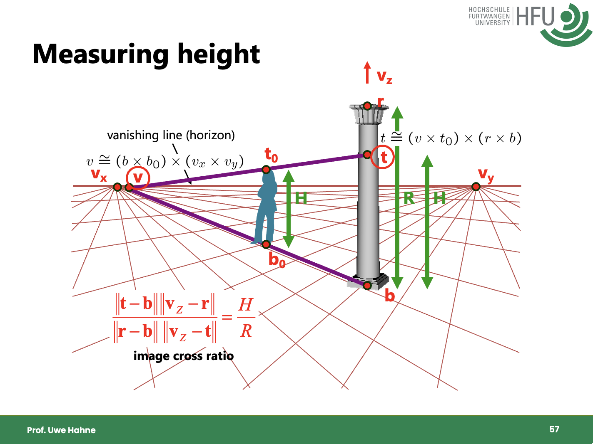

# 3DCV Workshop 02 - Height Measurement

## Workshop Overview

In this workshop, you will estimate the height of a cup from a single image using projective geometry and a reference object.

You are given three images of a table scene:

- `images/table_bottle01.jpeg`
- `images/table_bottle02.jpeg`
- `images/table_bottle03.jpeg`

The bottle height is known: **28 cm** (measured manually).
Your goal is to estimate the cup height in cm.

Use this slide for formulas and geometric setup (especially vanishing line and vertical transfer):

[3DCV-09-SingleView.pdf slide 61 (FELIX)](https://felix.hs-furtwangen.de/auth/RepositoryEntry/116195388/CourseNode/105308879908340)



## What You Build

Create a Python + OpenCV pipeline that:

1. Lets you click required image points.
2. Computes and draws the vanishing line of the table plane.
3. Transfers the known bottle height to estimate the cup height.

Important: Do not copy a complete ready-made solution. Implement step by step using the short hints below.

---

## Step 1 - Manually Select Key Points

### Task

Implement mouse-based point selection. You need points for:

- Bottle foot point (on table).
- Bottle top point.
- Cup foot point (on table).
- Cup top point.
- At least two line pairs on the table plane (for vanishing line construction).

Example: front/back table edges and left/right table edges.

### Minimal hint

```python
# Create a window
cv2.namedWindow("scene")
# prepare a list to store clicked points
clicked_points = []
# set a mouse callback to capture clicks
cv2.setMouseCallback("scene", on_mouse, clicked_points)

# the callback function to capture clicks
def on_mouse(event, x, y, flags, data):
	if event == cv2.EVENT_LBUTTONDOWN:
		data.append((x, y))
```

### Checkpoint

- Clicked points are visible in the image.
- Point order is documented in your code comments/readme.

### Challenge

Detect the corners of the table automatically using edge detection and corner detection (e.g., Harris corners, Shi-Tomasi, or FAST).

---

## Step 2 - Compute Table Plane Vanishing Line

### Task

Use two direction families on the table plane:

1. Build two lines from parallel edges in direction A, intersect them to get vanishing point $v_1$.
2. Build two lines from parallel edges in direction B, intersect them to get vanishing point $v_2$.
3. The line through $v_1$ and $v_2$ is the vanishing line (horizon) of the table plane.

### Minimal hint

Work in homogeneous coordinates:

```python
# Convert pixel points to homogeneous coordinates
def to_h(p):
	return np.array([np.float32(p[0]), np.float32(p[1]), 1.0])

# Point line duality applied 
line = np.cross(to_h(p1), to_h(p2))
point = np.cross(line_a, line_b)
point = point / point[2]
```

### Visualization hint

Using `cv2.line()` to draw lines has the benefit that you can use coordinates outside the image boundaries, which is useful for vanishing points. However, only integer values are allowed, so you may need to round or convert to int.

### Checkpoint

The vanishing line is computed and plausible for all three images. Note that the vanishing line may be outside the image, which is expected.

---

## Step 3 - Visualize necessary lines and intersections for height transfer

### Task

Set up the geometric construction from the slide:

- Known segment: bottle foot to bottle top corresponds to **28 cm**.
- Unknown segment: cup foot to cup top.
- Use vanishing entities and intersection constraints to transfer metric height from bottle to cup.

### Hint

Keep everything in homogeneous form as long as possible. Normalize only when converting back to pixel coordinates.

### Checkpoint

You can visualize all helper lines/intersections used for the height transfer.

---

## Step 4 - Compute cup height

### Task

Convert geometric transfer into a numeric scale relation.

The general idea is to use the fact that the vertical direction is parallel to the line through $b$ and $t$, and that the vanishing point $v_Z$ for vertical lines can be set to a very large value. This allows you to derive a formula for the cup height based on the known bottle height and the distances between points in the image:

$$
\frac{h_{cup}}{h_{bottle}} = \frac{\|t-b\|\|v_z - r\|}{\|r-b\|\|v_z - t\|}
$$

where $h_{bottle}=28$ cm and $t$ is obtained from your projective construction (according to the slide formula), while $b$ and $r$ are the bottle foot and top points.

### Hint

First, try to set the vertical vanishing point $v_Z$ to a very large value (e.g., $v_Z = (0, 10^6, 1)$) or eliminate it from the formula by using the fact that the vertical direction is parallel to the line through $b$ and $t$. Computing the vanishing point from clicked points is also possible but more error-prone if image resolution is low.

### Checkpoint

- Output a height estimate per image.
- Values are in a realistic range and reasonably stable across all three images.

---

## Step 5 - Quality Check

### Task

- Run your pipeline on all three provided images.
- Check how your click precision affects the height estimate by clicking multiple times on the same image.
- Compare results and comment on variance across images and clicks.
- Explain main error sources (click precision, perspective distortion, line choice, etc.).
- Show your results and insights in a short presentation to your peers and the instructor.

### Nice-to-have

- Add keyboard shortcuts: reset points, undo last point, save debug overlay.

---
